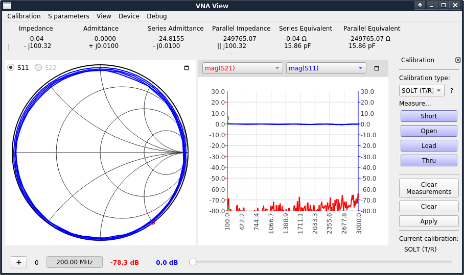
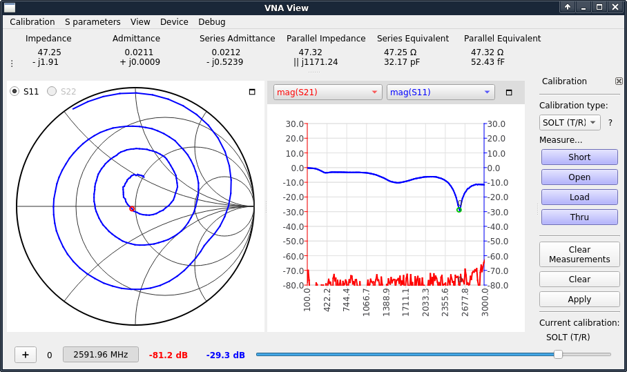
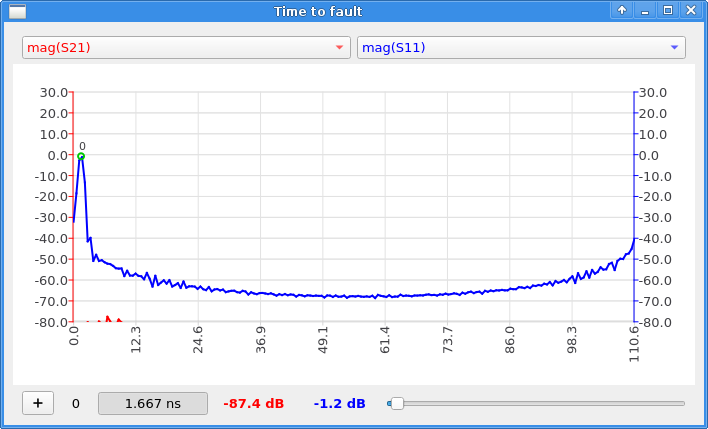

# NanoVNA-QT
NanoVNA V2配套的PC软件，可用于实时网络分析和测量，基于xaVNA软件。

PC GUI software for NanoVNA V2, based on the software for the xaVNA.


# 下载 / Downloads
For pre-compiled executables go to:
https://github.com/nanovna/NanoVNA-QT/releases


# 截图 / Screenshots

##### 开路同轴电缆 / Open circuited coax stub



##### 天线 / Antenna



##### 障碍距离 / Time to fault




# 编译 / Building the software

__Linux系统下编译 / Building on Linux__

编译 libxavna:
```bash
sudo apt-get install automake libtool make g++ libeigen3-dev libfftw3-dev
cd /PATH/TO/NanoVNA-QT
autoreconf --install
./configure
make
cd libxavna/xavna_mock_ui/
/PATH/TO/qmake
make
```

编译 QT 界面:
```bash
sudo apt-get install libqt5charts5-dev
cd /PATH/TO/NanoVNA-QT
cd vna_qt
/PATH/TO/qmake
make
export QT=/PATH/TO/QT # optional, e.g. ~/qt/5.10.1/gcc_64
../run ./vna_qt
```

__Mac系统下编译 / Building on mac os__
```bash
brew install automake libtool make eigen fftw
cd /PATH/TO/NanoVNA-QT
./deploy_macos.sh
# result is in ./vna_qt/vna_qt.app
```

__Linux系统下编译Windows目标 / Cross-compile for windows (from Linux)__

下载与编译 MXE:
```bash
cd ~/
git clone https://github.com/mxe/mxe.git
cd mxe
export QT_MXE_ARCH=386
make qt5 qtcharts cc eigen fftw pthreads
```
编辑mxe/settings.mk并将i686-w64-mingw32.shared添加到MXE_TARGETS变量。

Edit mxe/settings.mk and add i686-w64-mingw32.shared to MXE_TARGETS.

编译
```bash
cd /PATH/TO/NanoVNA-QT
export PATH="/PATH/TO/MXE/usr/bin:$PATH"
./deploy_windows.sh
```
